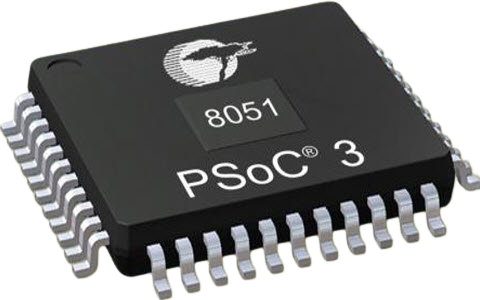

<h1 align="center">8051 Microcontroller Projects</h1>

  

  

---

In this repository, there are some simple projects done with the **8051 (8-bit) microcontroller**.

All of the projects are **open source** and you can use it for your own projects.

You can test them **without any Hardware**, they can be simulated as will be discussed in the README.md file inside each project. So, you don't need any hardware to run this operating system.

In every project, there is a README.md file which describes everything about the project:

* The description of the project
* Working steps of the project
* How to develop the code
* How to simulate the project
* Generation of documentation files.
* Results of the project

So, before using any of the projects, I recommend reading the README.md file inside each project.

---

## 🛠️ Development Tools Required

In order to use, develop, simulate any of these projects, read this [guide](https://github.com/makaram99/8051-projects/blob/master/tools.md) to know what tools are required before you start.

---

## 📞 Contact me

  

## 📖 References

* Embedded C book by: **M.j. Pont**

## 🔓 Licenses

 All DOCUMENTS inside this work is licensed under a <a rel="license" href="http://creativecommons.org/licenses/by-sa/4.0/">Creative Commons Attribution-ShareAlike 4.0 International License</a>.

All SOURCE codes & BINARIES are licensed under Mit License.

  

  

---

## 🔏 Credits

All credits and external sources are listed inside the page and inside this repo, references themselves.
