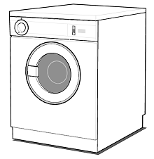
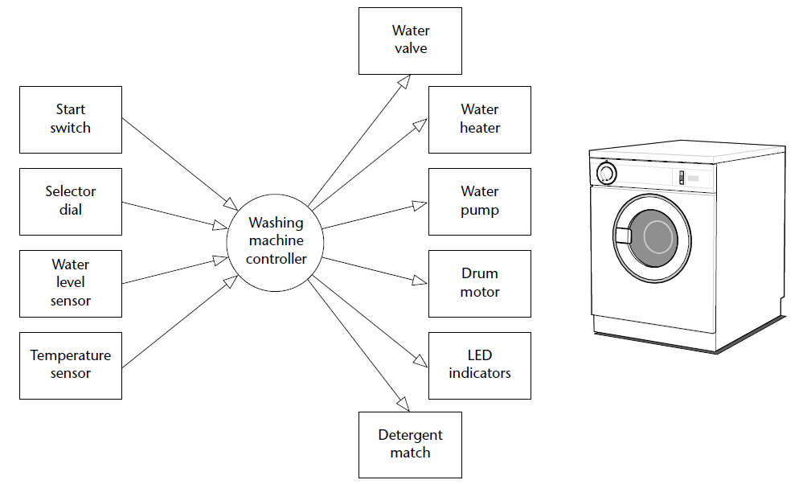
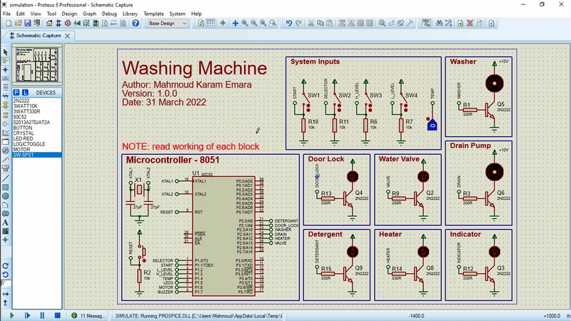
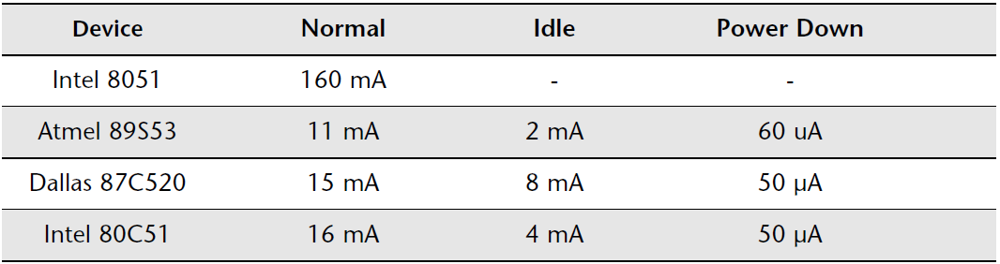
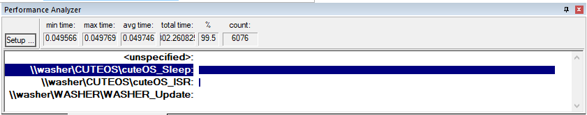

<h1 align="center">Washing Machine</h1>

  

<p align="center">
  
</p>

---

## 🔑 Introduction

This is a simple washing machine system, using the **8051 (8-bit) microcontroller**.
The washing machine is a multi-state (Time/Input) system which means it has different states for example initial state, washing state, drying state, filling water, heating water, etc.
Each state has a different behaviour. And transitions between states are defined by time passing and inputs.

<p align="center">
  
</p>

In this application, we are using the [Cute OS](https://github.com/makaram99/cute-os).

The project is **open source** and you can use it for your own projects.

You can test it **without any Hardware**, it can be simulated as will be discussed in the next sections. So, you don't need any hardware to run this operating system.

## Table of Contents

- [🔑 Introduction](#-introduction)
- [Table of Contents](#table-of-contents)
- [🛠️ Development Tools Required](#️-development-tools-required)
- [Project Hierarchy](#project-hierarchy)
  - [Directories](#directories)
  - [Files](#files)
- [⚙ Working](#-working)
  - [System Behavior](#system-behavior)
  - [Code](#code)
  - [Simulation](#simulation)
- [🎯 Results](#-results)
- [📑 Generate Documentation](#-generate-documentation)
- [📞 Contact me](#-contact-me)
- [📖 References](#-references)
- [🔓 Licenses](#-licenses)
- [🔏 Credits](#-credits)

---

## 🛠️ Development Tools Required

Read this [guide](https://github.com/makaram99/8051-projects/blob/master/tools.md) to know what tools are required to develop this project.

---

## Project Hierarchy

The project contains some files and directories:

### Directories

* **[code](code/)**: Contains the code implemented using VS Code and Keil-uVision5.
* **[docs](docs/)**: Contains the documentation files generated by doxygen and make, and others.
* **[simulation](simulation/)**: Contains the simulation files of Proteus8.9.

### Files

* **[README.md](README.md)**: The description of the project (What you are reading now).
* **[LICENSE](LICENSE)**: The license description of the project.
* **[Doxyfile](Doxyfile)**: The configuration of doxygen application (Documentation generator).
* **[doxygen.mk](doxygen.mk)**: Contains the configuration and rules to be run using make to generate documents.

---

## ⚙ Working

### System Behavior
It works as the following:

1. The user selects a wash program (e.g. ‘Wool’, ‘Cotton’) on the selector dial.
2. The user presses the ‘Start’ switch.
3. The door lock is engaged.
4. The water valve is opened to allow water into the wash drum.
5. If the wash program involves detergent, the detergent hatch is opened. When the detergent has been released, the detergent hatch is closed.
6. When the ‘full water level’ is sensed, the water valve is closed.
7. If the wash program involves warm water, the water heater is switched on.  When the water reaches the correct temperature, the water heater is switched off.
8. The washer motor is turned on to rotate the drum. The motor then goes  through a series of movements, both forward and reverse (at various speeds)  to wash the clothes. (The precise set of movements carried out depends on the wash program that the user has selected.) At the end of the wash cycle, the motor is stopped.
9. The pump is switched on to drain the drum. When the drum is empty, the pump is switched off.

### Code

To develop the project, you need to:

* YOU MUST HAVE **Keil-uVision5** installed on your computer.
* Open the **code** directory.
* Click twice on **[washer.uvproj](code/washer.uvproj)** file.
* It will open with Keil-uVision5.
* Enjoy the development.
* You can build the project by clicking on **F7** key on keyboard.

**NOTE**: I've documented the code as much as I can. So, I hope you will understand the code.

### Simulation

To simulate the project, you need to:

* YOU MUST HAVE **Proteus8.9** installed on your computer.
* Proteus8.9 has **compatibility issues** with its version, and the project may not be opened if you have a different version of Proteus8.9. So, you need to install **Proteus8.9 8.9** to be able to simulate the project.
* Open the [simulation](simulation/) directory.
* Click twice on [simulation.pdsprj](simulation/simulation.pdsprj) file.
* It will open with Proteus8.9.
* The simulation works as the following:
    
* Enjoy the simulation.
* To stop the simulation: Press twice on **ESC** key from the keyboard.

---

## 🎯 Results

After running the simulator on Keil-uVision5, the power consumption of the CPU decreased from **55mW** to **10.225mW**. This is because:

1. Current consumption of the CPU of each mode is:
    
2. Assuming we use Atmel 89S53 device (version of 8051 microcontroller manufactured by ATmel), the current consumption of the CPU is:
    * Idle mode: **2 mA**
    * Normal mode: **11 mA**
3. After simulating the code using uVision simulator, and profiling the execution time of function, the result is shown here:
    
5. So, the power consumption can be calculated as follow:
    * The 8051 microcontroller uses 5V Logic level.
    * The average current consumption of the CPU is:
      1. <u>Without cute OS</u>: the code is always running in **normal mode** and the current consumption is **11mA**.
      2. <u>With cute OS</u>: As shown in the above image, the code is running in:
          * **idle mode** (<u>washer_Sleep</u> function runs for 99.5% of the time.), and
          * **normal mode** (<u>washer_ISR</u> function runs for 0.5% of the time.).  
      3. So, the **average current** consumption is:  ```(11mA * 0.5% + 2mA * 99.5%) / 100 = 2.045mA```.
    * The power consumption of the CPU is:
      1. Without the OS: ```11mA * 5V = 55mW```
      2. With the OS: ```2.045mA * 5V = 10.225mW```

---

## 📑 Generate Documentation

To generate documentation:

1. YOU MUST HAVE **DOXYGEN** AND **MAKE** INSTALLED ON YOUR COMPUTER.
2. From the home directory of the project ([washer](./)), open the command prompt in your OS (**cmd** for Windows, **bash** for linux, ...)
3. Run the following command:
   ```make -f doxygen.mk all```
4. The documentation will be generated in the **[docs](docs)** directory.

**NOTE**: the file doxygen.mk is configured to run on Windows OS. If you want to run it on Linux OS, you need to change the configurations by opening the file and search for the section:

   ```ENVIRONMENT VARIABLES```

   and change each variable value depending on the OS you are using.
   Options are given in the comment before each variable.
   For example, to change the Shell name:

   ``` makefile
   # Shell of the OS, Options are: bash for Linux, sh for MacOS, cmd for Windows
    SHELL = cmd
   ```

Options for shell are:

* **bash** for Linux
* **sh** for MacOS
* **cmd** for Windows

---

## 📞 Contact me

<p><a href="https://www.linkedin.com/in/makaram99" target="_blank"></a> <a href="mailto:ma.karam272@gmail.com" target="_blank"></a> </p>

## 📖 References

* Embedded C book by: **M.j. Pont**

## 🔓 Licenses

<a rel="license" href="http://creativecommons.org/licenses/by-sa/4.0/"></a><br />All DOCUMENTS inside this work is licensed under a <a rel="license" href="http://creativecommons.org/licenses/by-sa/4.0/">Creative Commons Attribution-ShareAlike 4.0 International License</a>.

All SOURCE codes & BINARIES are licensed under Mit License.

<p align="center">
  

</p>

<p align="center">
  

</p>

---

## 🔏 Credits

All credits and external sources are listed inside the page and inside this repo, references themselves.
